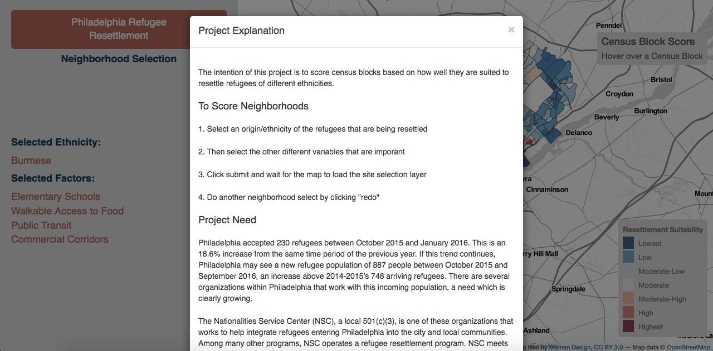
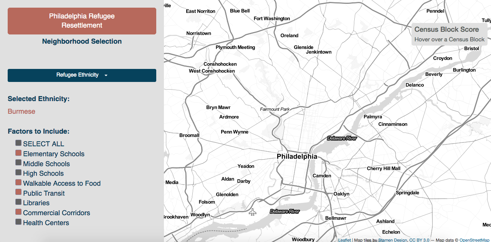
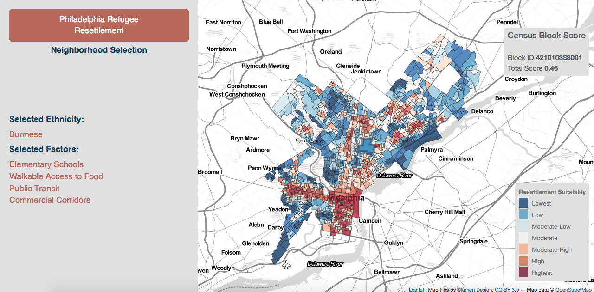

# Refugee Resettlement in Philadelphia
**An interactive web application, built using the CARTO SQL API and Leaflet, for selecting the optimal areas of the city for resettling refugees with different needs. Click [here](https://eneedham.github.io/refugee_resettlement/) to see it in action.**

*This repo is a result of a dual final project for the Advanced GIS class and the Javascript for Webmapping class at the University of Pennsylvania's School of Design. Both classes were taken as electives to complete the coursework for their Master's in City Planning degree.*

### Purpose of the Work
The intention for this project is to combine GIS analysis and web-mapping technologies to create an online tool that will help organizations determine neighborhoods which are best fits for resettling different categories of refugees within Philadelphia.

### Application Images
*Project Explanation Modal*

 
*Criteria Selection Sidebar*

 
*Map View - Blocks scored based on selection criteria*

### Project Need
Philadelphia accepted 230 refugees between October 2015 and January 2016. This is an 18.6% increase from the same time period of the previous year. If this trend continues, Philadelphia may see a new refugee population of 887 people between October 2015 and September 2016, an increase above 2014-2015’s 748 arriving refugees. There are several organizations within Philadelphia that work with this incoming population, a need which is clearly growing.

The Nationalities Service Center (NSC), a local 501(c)(3), is one of these organizations that works to help integrate refugees entering Philadelphia into the city and local communities. Among many other programs, NSC operates a refugee resettlement program. NSC meets the refugees at the airport, helps them navigate necessary paperwork and apply for benefits, gain access to the education and healthcare systems, and prepare for employment. Part of this work includes finding them new homes within different neighborhoods of Philadelphia. Every neighborhood offers a different range of services, cost of living, opportunities, social networks, and many other factors that are vital to successful resettlement.

The refugees entering Philadelphia from 2014-2015 came from at least 32 different countries, dictating a wide array of needs and desires in the resettlement process. NSC, and other similar organizations, could greatly benefit from a GIS tool that would help to identify different neighborhoods for resettlement based on the virtues of the neighborhoods and the needs of specific types of refugees. Such an analysis could be performed in a desktop GIS such as ESRI ArcMap but would require a license to the software. Several open source GIS softwares are available, however, these still require competency in acquiring data and utilizing the software. Many organizations may not have these technical skills in-house. A webmap with pre-loaded datasets and tools would be ideal in allowing such organizations to conduct GIS analysis, enabling them to more effectively resettle refugees and give them a greater chance at successful integration into their new communities.

### Project Report
The final report for the project can be viewed [here](https://drive.google.com/open?id=0B-4m-pGk-7czeWRJQXJjN2FPQTJySms2U1ZMYkhQV0hsVm5n).

#### Report Outline
  * Introduction
    * Project Need / Intro
    * Objective
  * Methodology
     * Tools
     * Data Acquisition & Cleaning
     * Data Processing (This includes a section for each piece of data used)
     * Creating the Web Application
       * Adding a Map
       * Reset Zoom
       * Creating Functions
       * Creating Dropdowns & Buttons
       * Adding Layers
  * Conclusion
    * The Application
    * Results
    * Successes
    * Shortcomings
    * Future Work
  * References
     
#### Suggestions for Writing the Report
* Take detailed notes throughout your project process. Even if you think it's not relevant or its too much detail, you will appreciate it later. In the future, if you ever need to replicate your work on a different topic, explain it to others, or improve upon it you will be much happier with yourself if you write it down. It will also make the writing of your report itself much easier. 
* Make your outline early and fill it in when you have time
* Decide who your audience is and write for them - don't make it more academic than it needs to be. 
* Use images and code snippets in your report as much as possible to more easily demonstrate your point
* Have a system for saving your images that makes sense to you - you might have to use them later (for example I've used images from a series of project to create one document that displays project summaries and design skills)

### Project Selection
It took me a good chunk of the semester to select this project. I originally had a different idea and began working on that but it was becoming clear that it wasn't going well. The idea for this project came from talking with other planning students. One group of students was doing their CED Practicum with the Nationalities Services Center. They mentioned that the organization had GIS site selection needs and that they could provide some data.

#### Project Selection Recommendations
* Try to actually start working as early in the semester as possible
* Talk to other people in your class, in your program, in life in general - the best ideas are usually things that are relevant to others. And projects that are relevant to others are likely to get the most hype and make the best impression to prospective employers.
* Choose something you are personally interested in and that you have the ability to wrap your head around. Choosing a project that requires an intense amount of subject-matter research before even beginning the project mgiht not be the best idea. 
* Think about how you can use this project to promote yourself - will it display valuable skills and expertise, is it something that prospective employers will be interested in?

### Job-getting Suggestions

#### Skills
* R
* Github - know at least enough to talk about it and to host your projects there
* Javascript, especially Leaflet to do mapping
* CARTO
* Mapbox
* PostGIS 
* SQL
* CSS/HTML (will be useful even if you're just using the CARTO editor)
* APIs - at least try to have used one or two to get data and know enough to talk about it
* QGIS
* Machine learning / predictive analytics

#### Other Stuff
* Check out this blog post by Sarah Cordivano - [Tips for Preparing for a Spatial Career](https://www.azavea.com/blog/2015/08/03/preparing-for-a-spatial-career-tips-for-students/).
* Make a website to display all of your projects, host it on Github
* Clone other projects on Github and mess around with them, your account will show all of the repos you have and the commits you make - good advertisement for employers
* When talking about your work you don't always have to make it clear it was course work unless someone asks
* Keep a running list of all of the technical skills you have and the projects you've done, even if they are very small - you never know what might strike someones interest.
* Always think about the design and aesthetics of your work. An ugly map, even if it shows groundbreaking work, won't get you as far as something beautiful. If you submit something for class that you didn't have enough time to work on the design, thats okay, but come back to it later and improve it. 
* Think about your audience - if they are non-technical, think creatively about ways that you can discuss the work you do and skills you have without using jargon. One suggestions - swap out "geospatial data" for "location data", people tend to know what that is but get scared away by the word geospatial. 
* Network!
  * Attend Code for Philly Hackathons
  * Attend GeoPhilly & Maptime
  * Reach out to local or non-local people who do interesting work - people are usually receptive and flattered if you do it just to learn about them and what they do. Try to do this as soon as possible, not when you're actually actively looking for a job - its better to form the relationships ahead of time so it doesn't seem like you're just asking for something. 

